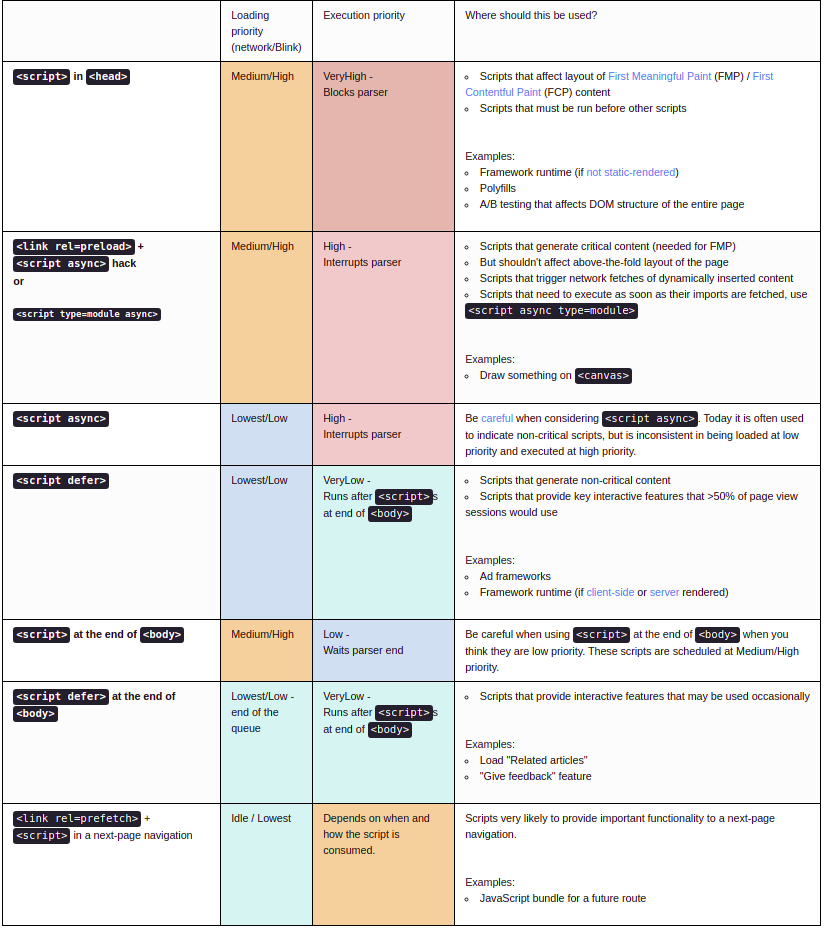

# What is the main functionality of a browser?

Browsers can **interpret and display content such as video, images, text, hyperlinks, and XML files**
The main task is to collect information from the Internet and make it accessible to users. A web browser can be used to visit any website. When we type a URL into a browser, the web server redirects us to that website.

## High level components of a browser

### USER INTERFACE

This component allows end-users to interact with all visual elements available on the web page. The visual elements include the **address bar, home button, next button,**
 and all other elements that fetch and display the web page requested by the end-user.

### BROWSER ENGINE

It is a core component of every web browser. The browser engine functions as an intermediary or a bridge between the user interface and the rendering engine. It queries and handles the rendering engine as per the inputs received from the user interface.

### RENDERING ENGINE

As the name suggests, this component is responsible for rendering a specific web page requested by the user on their screen. It interprets HTML and XML documents along with images that are styled or formatted using CSS, and a final layout is generated, which is displayed on the user interface.

### NETWORKING

This component is responsible for managing network calls using standard protocols like HTTP or FTP. It also looks after security issues associated with internet communication.

### JAVASCRIPT INTERPRETOR

This component is responsible for managing network calls using standard protocols like HTTP or FTP. It also looks after security issues associated with internet communication.

### UI BACKEND

This component uses the user interface methods of the underlying operating system. It is mainly used for drawing basic widgets (windows and combo boxes).

### DATA PERSISTENCE

It is a persistent layer. A web browser needs to store various types of data locally, for example, cookies. As a result, browsers must be compatible with data storage mechanisms such as WebSQL, IndexedDB, FileSystem, etc.

## How does parsing work?

Parsing means analyzing and converting a program into an internal format that a runtime environment can actually run, for example the JavaScript engine inside browsers.

The browser parses HTML into a DOM tree. HTML parsing involves tokenization and tree construction. HTML tokens include start and end tags, as well as attribute names and values. If the document is well-formed, parsing it is straightforward and faster. The parser parses tokenized input into the document, building up the document tree.

When the HTML parser finds non-blocking resources, such as an image, the browser will request those resources and continue parsing. Parsing can continue when a CSS file is encountered, but `<script>` tags—particularly those without an `[async]` or `defer` attribute—blocks rendering, and pauses parsing of HTML.

When the browser encounters CSS styles, it parses the text into the CSS Object Model (or [CSSOM], a data structure it then uses for styling layouts and painting. The browser then creates a render tree from both these structures to be able to paint the content to the screen. JavaScript is also downloaded, parsed, and then executed.

JavaScript parsing is done during [compile time] or whenever the [parser] is invoked, such as during a call to a method.

## The Order of Execution Of Scripts

If you aren't dynamically loading scripts or marking them as `defer`
 or `async`
, then scripts are loaded in the order encountered in the page. It doesn't matter whether it's an external script or an inline script - they are executed in the order they are encountered in the page. Inline scripts that come after external scripts are held until all external scripts that came before them have loaded and run.